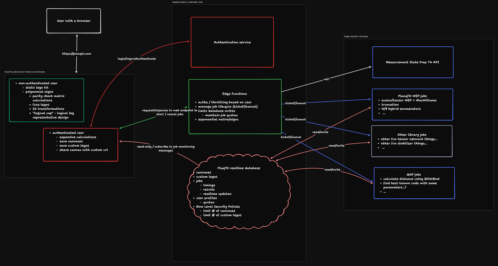

# Architecture

<p align="center">
</img>
</p>

PlanqTN features largely live in the user's browser. However, for background jobs and more complicated tensornetwork/lego database we offer the PlanqTN Jobs and the PlaqnTN API features.

# Setup

Depending on what you want to work on, your setup might require very minimal time/resouce investment or quite a bit, including setting up a local cloud on your laptop and/or a personal cloud infrastructure hooked up to Github Actions. Please review the development workflows below, and pick the required setup based on the component you want to contribute to.

# PlanqTN Components and development workflows

## The PlanqTN python library

### Components

Source code is in `qlego` (will shortly rename it to `planqtn`). Dependencies are in `requirements.txt` and `requirements.dev.txt` for development. `setup.py` drives the local installation and eventually the pypi setup.

### Development setup

For the python library, just simply clone the repo, and install the dependencies:

```
pip install -r requirements.txt -r requirements.dev.txt
```

### Checks and tests

Before committing, ensure that you followed the black formatting and tests are passing:

```
check/qlego
```

Note that both PlanqTN APIs and PlanqTN Jobs have depenencies on qlego, and changes will trigger integration tests on Github Actions.

## Web UI features

A large set of the features are only in the UI, which doesn't need any backend infrastructure. The PlanqTN UI is based on Vite/ReactJS and is served using Vercel.

### Components

Source code is contained within the `app/ui` folder. Vercel setup is in `vercel.json`.

### Development setup

After you cloned the repo, you can setup the npm dependencies with:

```
cd app/ui
npm install
```

Start the server in dev mode to get auto-reload:

```
cd app/ui
npm run dev
```

This should give you a http://localhost:5173 URL for the UI.

### Checks and tests

To execute formatting/linting and tests, run:

```
check/ui
```

## PlanqTN API

API calls are meant for features that return tensor network structures and/or legos, and are relatively fast, and don't need extensively long computation to work, for which jobs are a better mechanism.

### Components

PlanqTN API consists of the `app/planqtn_api` server, and the `tensornetwork` Supabase Edge Function at the moment and no database component yet (however, we we will develop quota functionality soon, which will involve database tables).

### Development setup

After you cloned the repo, you can setup the python dependencies with:

```
pip install -r requirements.txt -r requirements.dev.txt -r app/planqtn_api/requirements.dev.txt -r app/planqtn_api/requirements.dev.txt
```

To

### Checks and tests

Unit tests:

```
check/api
```

Integration tests:

```
export KERNEL_ENV=<local/dev/cloud>
check/api-integration
```

See below the reference for KERNEL_ENV.

## PlanqTN Background Jobs

Jobs allow for backend computation of arbitrary complexity, as long as it can be containerized, we can run it. Weight enumerator calculation and QDistRnd execution (coming soon) are the first two examples that use Jobs. Jobs will be subject to quotas and resource constraints (execution time, CPU number and memory) on the cloud environments, but can be executed on local kernels as well that are not subject to quotas/resource constraints.

### Components

PlanqTN Jobs consists of the `app/planqtn_jobs`, which contains a job-monitor service for Cloud Run and the job execution entrypoint `main.py`, and the following Supabase edge functions:

- `planqtn_job`/`planqtn_job_run` to kick off a job locally / Cloud Run
- `cancel_job`/`cancel_job_run` to cancel a job locally / Cloud Run
- `planqtn_job_logs`/`planqtn_job_logs_run` to retrieve job logs locally / Cloud Run

In the database the `tasks` table contains the task execution results and `task_updates` contain the realtime updates from the task execution.

### Checks and tests

```
export KERNEL_ENV=<local/dev/cloud>
check/jobs-integration
```

### The `dev` workflow

This is the typical, fastest way to check that things are working, but it's heavy on local resources.

- run `hack/htn kernel start` to spin up the `dev` kernel.
- Then, to build the jobs images and load them into the k3d cluster, run `hack/htn images jobs --build --load` (this will trigger the restart of the Supabase cluster). To run without supabase restart, which is a bit slow, you can instead run `hack/htn images jobs --build --load-no-restart`, but then in order for the Edge Runtime to pick up the new image tag, you'll need to manually run `npx supabase functions serve` from the `app` folder in the repo. This also has the benefit of showing the logs of the functions.
- After modifying `planqtn_jobs` or `qlego` or the edge function `planqtn_job`, run `export KERNEL_ENV=dev; check/jobs-integration`

### The `local` workflow

This is a workflow tested automatically by Github Actions, and is only required for developers to run if there is an issue with the Github Actions. These steps basically follow the relevant steps from .github/local_integration_tests.yml:

- install the `htn` tool: `hack/cli_build.sh --install`
- run `htn kernel start` to spin up the `local` kernel.
- Then, to build the jobs images and load them into the k3d cluster, run `hack/htn images jobs --build --load-no-restart --k3d-cluster local`
- After modifying `planqtn_jobs` or `qlego`, run `export KERNEL_ENV=local; check/jobs-integration`

### The `cloud` workflow

This is a workflow tested automatically by Github Actions, and is only required for developers to run if there is an issue with the Github Actions. These steps basically follow the relevant steps from .github/cloud_integration_tests.yml:

- setup `gcloud` to have you logged in, see Personal GCP setup below
- ensure that your Supabase env points to your personal Supabase project, see Personal Supabase setup below
- To build the jobs images and deploy them to Cloud Run, run `hack/htn cloud deploy`
- After modifying any of the components run `export KERNEL_ENV=cloud; check/jobs-integration`

# Reference for developer tools

## Personal cloud setup

We use GCP Cloud Run for executing workloads and the API and we use Supabase for the User context (authentication, task store, quota function, user content database) and the Runtime context (task management functions, api functions, realtime messaging database). Both Supabase references GCP (for the API/Job calls) and GCP references Supabase (to write results/task updates back to the Supabase database). Please follow the order of setup as listed below, start with Supabase, then with GCP, and finally deploy the Supabase functions/secrets.

Requirements:

- NodeJS
- Docker (Desktop)
- DockerHub identifier, where you can push images to
  - run `docker login` to ensure you're logged in

From the root of the repo we'll start with installing some necessary tools in the `node_modules` directory locally.

```
npm install --include-dev
```

- a free tier Supabase.com project and secrets (see below)
- a free tier GCP project and secrets (see below)

### 1. Personal Supabase setup for database storage, realtime messaging and authentication

1. Setup your account at https://supabase.com/
2. Create a new organization e.g. "Your Name"
3. Create a a new project e.g. "<yourname>-planqtn-dev" or similar
4. Note down the following secrets:

- note down the database password (though you can reset it from your dashboard)
- your project ref (which is in the `[project-ref].supabase.co` in the "Connect" menu point)
  
- Get the `service_role` key and `anon_key` from your personal Supabase project via Project Settings/API Keys, click Reveal for the service role key:
  

### 2. Personal GCP setup for running workloads

1. Register for a Google Cloud Platform and start a new GCP Project https://cloud.google.com/?hl=en - you will need to add a Billing account, but don't worry, none of the developments will cost anything at our size.
2. Download `gcloud` on Linux/MacOSX, so that it can be used in the scripts: https://cloud.google.com/sdk/docs/install
3. Run `gcloud init` to create a new local gcloud configuration that points to your project, choose `us-east1` if you're unsure what to choose for your environment.
4. Run `gcloud auth login` to enable automatically gcloud to act on your behalf
5. Create the following for managing the state via terraform:

```
export MYNAME=<your-name>
gsutil mb gs://planqtn-$MYNAME-tfstate
gsutil versioning set on gs://planqtn-$MYNAME-tfstate
```

### 3. Personal Vercel setup for UI hosting

Sign up for Vercel on https://vercel.com. You'll need a social login or email + text number.
Most importantly don't import your fork directly through the Vercel app, we handle the CI/CD deployment ourselves, the Vercel git integration will just get in the way.

1. Install the vercel CLI tool

```
npm install -g
```

2. Login to vercel

```
vercel login
```

3. Create a new project

```
export VERCEL_PROJECT=planqtn-<yourname>
vercel projects add $VERCEL_PROJECT
```

4. Link the project

From the repo root run:

```
cd app/ui
vercel link
```

This will ask you for

- the "scope" (which is the team/organization)
- link to existing project? Answer yes
- you'll have to type in the name of your project (`planqtn-<yourname>`)

```
$ vercel link
Vercel CLI 42.3.0
? Set up “.../planqtn/app/ui”? yes
? Which scope should contain your project? <your org name, e.g. John Doe's projects>
? Link to existing project? yes
? What’s the name of your existing project? planqtn-<yourname>
✅  Linked to john-does-projects/planqtn-<yourname> (created .vercel)
```

Note that the project ID and organization ID are generated under `app/ui/.vercel/project.json` - this is what you'll need to setup Github Actions for your own repo and the `htn` tool will use this file to print out the values. To unlink, you need to run `rm -rf app/ui/.vercel`.

### 4. Deploy your project

```
hack/htn cloud deploy
```

This should walk you through the process automatically, and will ask you interactively for the secrets above.

During the first run, things might take a while, as APIs need to be enabled, and resources are created the first time.
Also, you might need to rerun it, we've seen this kind of failure on new project creation:

```
│ Error: Error creating service account: googleapi: Error 403: Identity and Access Management (IAM) API has not been used in project [PROJECT-NUMBER] before or it is disabled. Enable it by visiting https://console.developers.google.com/apis/api/iam.googleapis.com/overview?project=[PROJECT-NUMBER] then retry. If you enabled this API recently, wait a few minutes for the action to propagate to our systems and retry.
│ Details:
```

## Github Actions secrets for your personal integration testing environment

After your setup and deployed your project successfully ensure that the integration tests are passing: 
```
export KERNEL_ENV=cloud
hack/job-integrations
hack/api-integrations
```

If everything's good, you're ready to setup Github Actions! As we need to setup a bunch of secrets and variables, we tried to make this less of a pain as well. Follow the prompts from this script:

```
hack/htn cloud setup-github-actions
```

## PlanqTN CLI

The CLI can be run in two modes:

- `local` mode - this is what end users will use, and what the CLI is meant to be used for in production and CI/CD environments. The tool operates in $HOME/.planqtn and has prepackaged configuration definitions for the supabase / k8s clusters. It does not need the project git repo to work. The postfix on all objects (containers, docker network, supabase instance) is `-local`.

- `dev` mode - it works solely from the git repo, and is meant to "dog food" our own CLI tool, but without the need to build the tool and install it every time things change, also allowing for fast reload of function development in supabase. The postfix on all objects (containers, docker network, supabase instance) is `-dev`. The `dev` mode also allows for image building (`images` subcommand), and deployment to the cloud environments. the `dev` mode is what's used for cloud deployment as well.

### Dev mode - using htn for development (and cloud deployment)

Simply run `hack/htn` instead of `htn`, and things should work. We wrap certain tasks into `htn` scripts that frequently happen together or need to happen together as an atomic unit, for example, spining up a local env and applying database migrations on it, or building an image and reloading it into a local env, or deploying a Cloud Run service with it.

### Building for local mode

To build the tool, run

```
hack/cli_build.sh
```

This allows you to inspect the app/planqtn_cli/dist folder content.

Install the tool globally, to use local kernel mode

```
hack/cli_build.sh --install
```

Now,

```
htn --help
```

should work.

## Setting up kernel environments

KERNEL_ENV is used by the integration tests (`check/jobs-integration` and `check/api-integration` scripts) to determine which kernel to use.

The options for KERNEL_ENV are:

- `local` simulates the user's local environment, assuming that there is a local kernel running and has the latest images.
- `dev` for a locally running development kernel that allows "hot reload" features from the repo directly
- `cloud` will connect to the developer's personal cloud services, including Supabase and Google Cloud Platform (GCP) project for Cloud Run.

Note that `local` and `dev` are allowed to coexist, but currently ports are the same, so only one of them can be active at a time.

### Setting up `local` kernel

First, build & install `htn` globally:

```
hack/cli_build.sh --install
```

Then use it:

```
htn kernel start
```

Warning, this needs roughly $HOME40-50GB disk space and $HOME5-15GB RAM for the Docker runtimes.

### Setting up `dev` kernel

Simply run:

```
hack/htn kernel start
```

Warning, this needs roughly $HOME40-50GB disk space and $HOME5-15GB RAM for the Docker runtimes.

### Setting up `cloud` kernel

See above for personal cloud setup.

## Database migrations

TODO: this will be filled out after merging the first version of supabase to main and testing on the first change.

```

```
